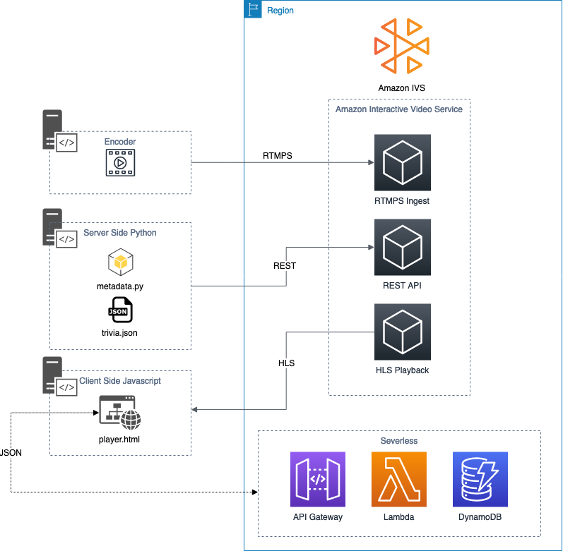

# Using Amazon Interactive Video Service Timed Metadata

This repo is part one of a two-part series to excite and enable developers to build and learn how to use the [Amazon Interactive Video Service (Amazon IVS)](https://aws.amazon.com/ivs/) Timed Metadata feature. In this walk-through, you will build a full end-to-end working demonstration of an Amazon IVS live stream that provides a fully interactive experience for viewers. I designed this walk-through as a bare bones demonstration of the technology so that a developer can learn how the functionality works. While the underlying services such as Amazon IVS are highly scalable and secure, the design of this demo is not intended for production use. If you are looking for a starter kit for your production workflow, please check out this [blog post](https://aws.amazon.com/blogs/media/setting-up-for-streaming-with-amazon-ivs/) about setting up streaming for Amazon IVS. But, if you would like to create a sandbox to learn how the Timed Metadata feature works, this blog post is for you. Part one focuses on the Timed Metadata feature, while part two looks at the underlying infrastructure needed to create a fully interactive experience.

## Blog Posts

Please visit the following locations for detailed information about this code:

[Using Amazon Interactive Video Service Timed Metadata Part 1](https://aws.amazon.com/blogs/media/) Coming Soon!

[Using Amazon Interactive Video Service Timed Metadata Part 2](https://aws.amazon.com/blogs/media/) Coming Soon!

## Overview

## Tutorial 1

Tutorial 1 uses a python and HTML files to create a full end to end example use of IVS's "timedMetadata" feature.

[Read more here](Tutorial_1/README.md)

## Tutorial 2

Tutorial 2 uses a Cloudformation Template to deploy a feature rich version of Tutorial 1 that includes a DynamoDB Database and API Gateway to interact with Interactive Video Service's timedMetadata feature.

[Read more here](Tutorial_2/README.md)

## Security

See [CONTRIBUTING](CONTRIBUTING.md#security-issue-notifications) for more information.

## License

This library is licensed under the MIT-0 License. See the LICENSE file.
